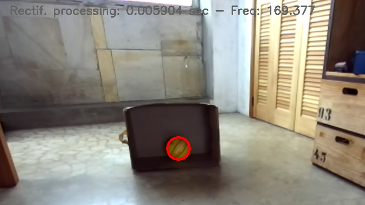

# CamBallToe

The Brazilian version of the popular game TicTacToe - using a football and the playing wall of your choice. 


## Description

Let's play tic tac toe using a football while the ball position is detected by a camera. 

This code is based on [zed-open-capture](https://github.com/stereolabs/zed-open-capture)

### Current Status

- User clicks onto 3 points to define playing wall
- A ball can be detected in an image taken by the ZED 2 camera



## ToDo

- [ ] draw target playing wall
- [ ] detect wall distance
- [ ] using ball diameter and safety margin, detect when ball hits wall


## Build and install

### Prerequisites

 * USB3 Stereolabs Stereo camera: [ZED 2i](https://www.stereolabs.com/zed-2i/), [ZED 2](https://www.stereolabs.com/zed-2/), [ZED](https://www.stereolabs.com/zed/), [ZED Mini](https://www.stereolabs.com/zed-mini/)
 * Linux OS
 * GCC (v7.5+)
 * CMake (v3.1+)
 * OpenCV (v3.4.0+) -Optional for the examples- 

### Install prerequisites

* Install GCC compiler and build tools

    `sudo apt install build-essential`

* Install CMake build system

    `sudo apt install cmake`

* Install HIDAPI and LIBUSB libraries:

    `sudo apt install libusb-1.0-0-dev libhidapi-libusb0 libhidapi-dev`

* Install OpenCV to build the examples (optional)

    `sudo apt install libopencv-dev libopencv-viz-dev`

### Clone the repository

```bash
git clone https://github.com/FadriPestalozzi/zed-open-capture
cd zed-open-capture
```

### Add udev rule

Stereo cameras such as ZED 2 and ZED Mini have built-in sensors (e.g. IMU) that are identified as USB HID devices.
To be able to access the USB HID device, you must add a udev rule contained in the `udev` folder:

```bash
cd udev
bash install_udev_rule.sh
cd ..
```

### Build

```bash
cmake .. && make -j$(nproc) && ./zed_open_capture_detectball
```

<!-- ### Install

To install the library, go to the `build` folder and launch the following commands:

```bash
sudo make install
sudo ldconfig
``` -->

<!-- ## Run -->


<!-- ## Documentation -->


## Coordinates system

The coordinate system is only used for sensor data. The given IMU and Magnetometer data are expressed in the RAW coordinate system as shown below


<!-- ## Known issues

### OpenGL version
On some embedded devices, like Raspberry Pi 4, the depth extraction example can crash with the following error:

`vtkShaderProgram.cxx:438    ERR| vtkShaderProgram (0x23a611c0): 0:1(10): error: GLSL 1.50 is not supported. Supported versions are: 1.10, 1.20, 1.00 ES, and 3.00 ES`

to correctly execute the example application it is necessary to change the default OpenGL version:

```
export MESA_GL_VERSION_OVERRIDE=3.2
```

you can permanently add this configuration by adding the above command as the last line of the `~/.bashrc` file. -->

<!-- ## Related

- [Stereolabs](https://www.stereolabs.com)
- [ZED 2i multi-sensor camera](https://www.stereolabs.com/zed-2i/)
- [ZED SDK](https://www.stereolabs.com/developers/) -->

<!-- ## License

This library is licensed under the MIT License.

## Support

If you need assistance go to our Community site at https://community.stereolabs.com/ -->

